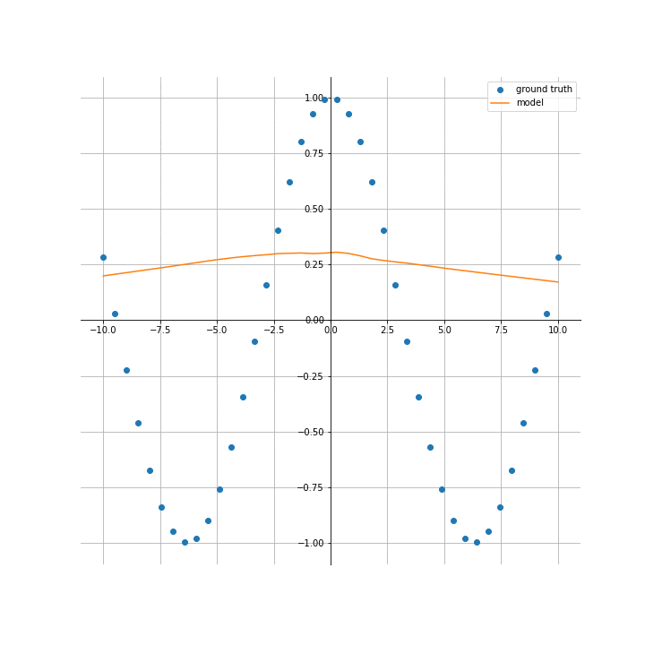

<!-- _class: invert -->
# Representational Networks

## Hallison Paz

### November 8th, 2023

---

# Hallison Paz

- AI Graphics Researcher
- PhD Candidate 
@IMPA, @Visgraf

- Alma Mater: 
Instituto Militar de Engenharia

- Co-founder
@Programação Dinâmica

---
<!-- _class: invert -->

---
# Codec Avatars

- Research Scientist Intern at Reality Labs Research (Meta). Pittsbugh, PA, USA.

<!-- _footer: Lex Fridman [podcast using avatars](https://youtu.be/MVYrJJNdrEg?si=yG_Hhx1JsBrBXHNa) -->
----
# Representational Networks

> You put water into a cup, it becomes the cup
– Bruce Lee

<!-- _footer: Apurba Kanti Roy, [CC BY-SA 4.0](https://creativecommons.org/licenses/by-sa/4.0), via Wikimedia Commons -->

<!-- _footer: check more details [at this video](https://www.youtube.com/live/voVBM6BYs8k?si=lgOZT6BRh9eL8fz3). -->
---

# Representational Networks

---

<!-- _footer: Source: https://youtu.be/Wo0QVVM5jXE?si=9uxYNqsLNk0jAr8X -->

---
# Implicit Models

---

# Deep SDF

----
# Neural Radiance Fields (NeRFs)

<video width="1200" height="800" controls>
  <source src="img/nerf-example.mp4" type="video/mp4">
</video>

----

# References:

- [Implicit Neural Representations
with Periodic Activation Functions](https://www.vincentsitzmann.com/siren/).
- [NeRF: Representing Scenes as Neural Radiance Fields for View Synthesis](https://www.matthewtancik.com/nerf).
- [Occupancy Networks - Learning 3D Reconstruction in Function Space](https://github.com/autonomousvision/occupancy_networks).
- [AI Graphics Theory and Practice](https://lvelho.impa.br/i3d23/). IMPA Course.
- [The making of MR-Net and a vision for multiresolution media representation](https://www.youtube.com/live/voVBM6BYs8k?si=lgOZT6BRh9eL8fz3). Visgraf Seminar.

<!-- _paginate: true -->
---
<!-- _class: invert -->

# Demo

### [Training a representational network for images](https://github.com/hallpaz/nov23google/blob/main/code/representational_networks.ipynb)

---

---

# Continuous Scale

<!--  -->

<video width="1102" height="600" controls>
  <source src="img/continuous_scale.mov" type="video/mp4">
</video>

---

# Textures

see: https://www.youtube.com/live/voVBM6BYs8k?si=Zxj4gtWJe893uzuV&t=4225

---
# Thank you!

#### Reach out:

- hallpaz@impa.br
- [@pgdinamica](https://youtube.com/@pgdinamica) on Youtube
- @hallpaz at social media

<!-- _class: invert -->